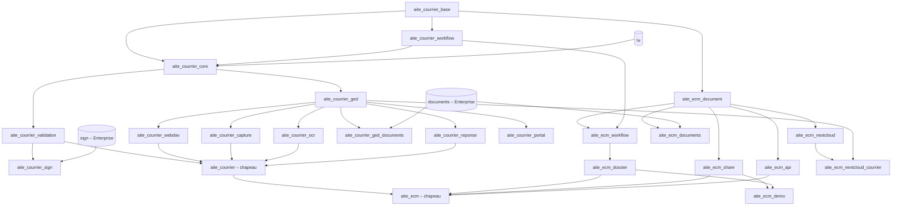

# AITE Courrier / AITE ECM — État des lieux du dépôt

*Audit du code au 8 septembre 2026 (branche `main`, commit unique `0133173` « initial commit »). Document de référence pour la roadmap « ECM complet avec WebDAV fonctionnel ».*

> ## ⚠️ Addendum du 10 septembre 2026 — ce document est un instantané daté
>
> Cet audit décrit le dépôt au commit `0133173`. Il a été suivi de la livraison
> `8ac0a08` (« maj ok ») puis d'une **campagne de recette exécutée sur instance
> réelle** — Odoo 18 Community installé, jeu de 346 documents, 34 scénarios,
> 152 tests automatisés, 32 cas protocolaires WebDAV. Résultats et preuves :
> **[`docs/uat/DOSSIER_UAT.md`](../uat/DOSSIER_UAT.md)** (et sa version PDF).
>
> **L'analyse du corps n'est pas réécrite** — c'est un état de référence daté —
> mais tous les endroits que la recette contredit sont **annotés sur place**, afin
> qu'un lecteur qui entre par le § 5.3 ou le § 9 ne lise pas un verdict périmé :
>
> - § 1.1 et § 1.2 : notes datées sur les constats devenus faux ;
> - § 5.3 : le tableau de verdict WebDAV distingue désormais les **deux** points
>   d'entrée, celui de l'ECM (livré depuis) et celui du courrier (inchangé) ;
> - § 9 : le tableau des 22 constats porte une colonne **« État au 10/09/2026 »**,
>   où « — non réinstruit » signifie *ni confirmé, ni infirmé* — à ne pas lire
>   comme corrigé.
>
> Sur les dix constats qui structurent la roadmap (§ 1.3), **quatre sont fermés**
> et il ne faut plus planifier sur leur base :
>
> | Constat § 1.3 | État au 10/09/2026 | Preuve |
> |---|---|---|
> | **1.** L'ECM n'a aucune exposition « système de fichiers » | ✅ **Fermé** — `aite_ecm_webdav` monte le plan de classement, les dossiers et les documents | SC-11.0 à SC-11.25 |
> | **2.** WebDAV non prêt pour Word/Excel/Finder : verrous factices, pas d'ETag, fichiers temporaires | ✅ **Fermé** — verrous réels adossés au check-out ECM (423 sur écriture concurrente), ETag = SHA-256 de la version, `Last-Modified` RFC 1123, fichiers `~$…`/`.tmp` refusés en 403 | SC-11.12 à SC-11.19 |
> | **4.** La machine à états du courrier n'utilise que 4 de ses 6 statuts | ✅ **Fermé** — « En traitement » posé au franchissement d'étape, « Validé » retiré | ANO-08 |
> | **8.** Aucune rétention, archivage légal, scellement ni conformité | ✅ **Fermé** — `aite_ecm_records` (DUA, sort final, gel juridique, bordereaux, archives physiques) et `aite_ecm_sae` (sceaux SHA-256 chaînés, export SEDA 2.1), testés | SC-06, SC-07 |
>
> **Ce qui reste ouvert, et qui appartient toujours à la roadmap :**
>
> - **Constat 3** (deux moteurs de workflow), **7** (pont Documents Enterprise),
>   **9** (documentation produit périmée), **10** (industrialisation : ni CI, ni
>   traduction, ni gestion de dépendances) : **non traités**.
> - **Constat 6** (couverture de tests) : **partiellement traité**. Le banc de
>   test ECM, qui était inopérant, est réparé et la suite est verte
>   (152 tests, 0 échec). Mais **11 modules sur 28 n'ont toujours aucun test**,
>   dont précisément les couches exposées aux tiers que l'audit visait :
>   `aite_ecm_api`, `aite_ecm_share`, `aite_courrier_portal`,
>   `aite_courrier_capture`, `aite_courrier_ocr`, `aite_courrier_reponse`.
>   L'API REST et le partage externe ont été validés **manuellement** en
>   campagne (SC-09, SC-05) — ce n'est pas de la non-régression.
> - **Constat 5** (matrice de droits) : le cloisonnement effectif a été
>   **mesuré** (§ SC-12 du dossier de recette : 346 documents, 8 comptes, le
>   compte Audit ne voit aucun document confidentiel) et il est cohérent. La
>   critique de conception de l'audit n'a pas été réinstruite pour autant.
> - **§ 5.3, ligne « Authentification entreprise (2FA, SSO, clés API) »** :
>   **toujours absent**, et vérifié le 10/09/2026. Le WebDAV ECM
>   s'authentifie uniquement par mot de passe, et se ré-authentifie à chaque
>   requête. Une clé d'API valide est **refusée en 401** par le WebDAV alors que
>   la même clé est acceptée en 200 par l'API REST. Conséquence de déploiement :
>   **un compte avec 2FA activée, ou un compte SSO sans mot de passe local, ne
>   peut pas monter le lecteur réseau.** À traiter avant un déploiement où la
>   2FA est imposée.
> - **Prérequis de déploiement** (nouveau, pas un défaut) : le serveur doit
>   exposer **une seule base résolvable** (`db_name` ou `--db-filter`). Un client
>   WebDAV n'envoie aucun cookie de session, la base ne peut donc pas être
>   déduite, et les deux points d'entrée répondent 404 sans cela.
>
> Le choix d'architecture posé au § 5.3 — WebDAV servi par Odoo *ou* Nextcloud
> comme espace fichiers — est tranché de fait : **la voie WebDAV est en place et
> vérifiée**. Le connecteur Nextcloud reste disponible et testé sur simulateur,
> mais n'est plus le seul chemin vers « voir les documents comme des fichiers ».

**Méthode.** Lecture intégrale des 23 modules (12 887 lignes Python, 5 591 lignes XML, 752 lignes JavaScript, 20 fichiers de tests, 14 cahiers de tests, 5 documents produit), vérification statique (compilation Python, validité XML/CSV, inventaire des modèles, routes, règles, crons), croisement documentation ↔ code. **Odoo n'est pas installé dans l'environnement d'audit : aucun test n'a été exécuté.** Les comportements dépendant du framework ou de l'app Documents Enterprise sont signalés « à confirmer sur instance ». Chaque constat est référencé par fichier et ligne.

---

## 1. Synthèse

### 1.1 Réponse courte

Le dépôt contient **deux produits emboîtés** : une suite de gestion du courrier (v1, 13 modules) et une « Fondation ECM » (v2.0, 10 modules) qui s'appuie sur son socle. Le cœur est réel, cohérent et testé par cahiers (133 tests, tous au niveau ORM). Mais, au regard de l'objectif :

* **L'ECM n'est pas « complet »** : le référentiel documentaire, le plan de classement avec droits hérités, les versions, le check-out, les métadonnées, l'explorateur natif, les dossiers métier, le workflow polymorphe, le partage sécurisé et l'API existent ; il manque la rétention/archivage, le scellement, la recherche unifiée (OCR limité au courrier), un moteur de workflow unique, une API CRUD complète, la traduction, et plusieurs briques livrées sans test ni règles de visibilité (partages, dossiers, historique de circuit).
  > **10/09/2026 — partiellement obsolète.** La rétention/archivage (`aite_ecm_records`) et le scellement (`aite_ecm_sae`) sont livrés et testés. Restent vrais : moteur de workflow unique, API CRUD complète, traduction, et l'absence de règle de visibilité sur les **partages** (`aite_ecm_share/security/` ne contient toujours aucun `ir.rule`) et sur l'**historique de circuit** (`aite_ecm_workflow/security/` non plus) — les dossiers métier, eux, ont désormais leurs règles.
* **Le WebDAV n'est pas « fonctionnel » au sens bureautique** : il fonctionne en consultation et dépôt avec rclone/curl sur les **pièces de courrier uniquement**. Il **n'expose pas l'ECM**, ses verrous sont factices, il n'a ni ETag ni gestion des fichiers temporaires d'Office/Finder, il exclut les comptes 2FA/SSO, se ré-authentifie à chaque requête, et sa couche HTTP n'a aucun test. Le montage lecteur réseau Windows n'est pas documenté comme validé.
  > **10/09/2026 — obsolète pour l'ECM, toujours vrai pour le courrier.** Ce constat portait sur `aite_courrier_webdav`, seul point d'entrée existant alors. Un **second** point d'entrée a été livré depuis, `aite_ecm_webdav` (`/webdav/aite_ecm`), qui expose le plan de classement, adosse ses verrous au check-out ECM, publie un ETag SHA-256 et refuse les fichiers temporaires d'Office : **32 cas protocolaires sur 32**, couche HTTP testée. Le point d'entrée **courrier** (`/webdav/aite_courrier`), lui, n'a reçu que les correctifs `HEAD`, 415 et `readonly` : vérifié le 10/09/2026, il **n'a toujours ni ETag ni verrou réel**. Enfin, l'exclusion des comptes 2FA/SSO reste vraie **pour les deux** (cf. addendum en tête).
* **Une alternative crédible existe** : le connecteur Nextcloud (miroir bidirectionnel testé sur un faux serveur) couvre synchronisation, édition en ligne et liens publics, au prix d'une copie des fichiers et d'un rapprochement de comptes non fait.

### 1.2 Maturité par bloc

| Bloc | État | Commentaire |
|---|---|---|
| Socle (référentiels, groupes, audit) | ✅ Opérationnel, testé | audit immuable, 8 rôles ; pas de rétention du journal, pas de multi-société |
| Moteur de circuits + 5 circuits | ✅ Opérationnel, testé | linéaire ; pas de parallélisme, conditions, calendrier ouvré ; circuits non instanciés |
| Courrier (cycle de vie, SLA, AR) | 🟡 Opérationnel, testé, incomplet | ~~statuts « En traitement »/« Validé » jamais atteints~~ **corrigé 10/09** ; matrice de droits incohérente avec les rôles ; notifications massives |
| Validation | ✅ Opérationnel, testé | contrôle serveur systématique ; commentaire ouvert à tout lecteur |
| GED courrier | 🟡 Opérationnel, testé | suppression sans garde-fou, MIME par extension, pas de dédoublonnage |
| WebDAV courrier | 🟡 Partiel | cf. §5 : classe 1 partielle, classe 2 annoncée mais factice, HTTP non testé — **inchangé au 10/09** (ni ETag ni verrou réel) |
| **WebDAV ECM** *(livré après l'audit)* | ✅ **Opérationnel, testé** | `aite_ecm_webdav` : plan de classement monté, verrous adossés au check-out, ETag SHA-256, 32 cas protocolaires sur 32 ; n'accepte que le mot de passe (pas de clé d'API, donc 2FA incompatible) |
| Tableau de bord | ✅ Opérationnel | KPI « en cours » et « délai moyen » approximatifs |
| Capture e-mail, OCR, Réponses | 🟡 Livrés, **0 test** | défauts de conception (duplication, file OCR bloquante, PDF sans destinataire) |
| Signature (Sign), Portail | 🟡 Optionnels, **0 test** | trous de contrôle d'accès, PDF signé non rapatrié, jetons permanents |
| Pont Documents (courrier + ECM) | 🔴 Enterprise, fragile | confidentialité non projetée, adoption ECM probablement inopérante, contournement des règles ECM |
| Socle ECM (documents, dossiers, versions, explorateur) | ✅ Opérationnel, testé | le module le plus abouti ; ~~pas de rétention, pas de scellement, pas de WebDAV~~ **les trois sont livrés et testés au 10/09** |
| **Conservation, archivage légal** *(livré après l'audit)* | ✅ **Opérationnel, testé** | `aite_ecm_records` : DUA, sort final, gel juridique, bordereaux d'élimination, archives physiques |
| **Valeur probante** *(livré après l'audit)* | ✅ **Opérationnel, testé** | `aite_ecm_sae` : sceaux SHA-256 chaînés, journal de preuve, export SEDA 2.1 |
| Workflow polymorphe, Dossiers métier | 🟡 Opérationnels, testés a minima | bug de filtre, doublon de moteur, aucune règle de visibilité sur dossiers/historique |
| Partage sécurisé, API REST | 🟡 Livrés, **0 test** | partages lisibles par tous, consultation seule non contraignante, CORS inopérant, CRUD partiel |
| Nextcloud | 🟡 Opérationnel sur simulateur | non validé sur instance réelle ; comptes non rapprochés ; confidentiel courrier non filtré |
| Jeu de données de test | 🟡 Riche, **0 test** | boucle infinie sans le module Courrier |
| Industrialisation | 🔴 Absente | pas de CI, pas de `requirements`, pas de traduction, docs obsolètes, un seul commit |

### 1.3 Les dix constats qui structurent la roadmap

1. Le WebDAV ne couvre que le courrier ; l'ECM (`aite.ecm.document`, `aite.ecm.folder`) n'a aucune exposition « système de fichiers » (§5.2 A).
2. Le WebDAV n'est pas prêt pour Word/Excel/Finder : verrous factices, pas d'ETag, fichiers temporaires transformés en documents ou refusés, 2FA exclu, ré-authentification par requête (§5.2 B-C).
3. Deux moteurs de workflow coexistent (courrier v1, mixin ECM), avec deux historiques et deux audits (§4.2).
4. La machine à états du courrier n'utilise que 4 de ses 6 statuts (§3.2).
5. La matrice de droits de la suite Courrier ne correspond pas aux rôles métier ; l'ECM en corrige la logique mais laisse partages, dossiers métier et historique sans règle de visibilité (§3.2, §4.2-4.4).
6. Onze modules sur vingt-trois n'ont aucun test, dont tout ce qui est exposé aux tiers (portail, partage, API, capture, webhook courrier) (§7).
7. Le pont vers l'app Documents contourne les règles ECM et ne projette pas la confidentialité (§4.6, §3.2).
8. Aucune fonction de rétention, d'archivage légal, de scellement ni de conformité n'existe (§4.1, §8.3).
9. La documentation produit décrit un produit à 7 modules qui n'existe plus ; plusieurs promesses sont fausses (§8).
10. Aucune industrialisation : pas de CI, pas de traduction, pas de gestion des dépendances, historique git inexploitable (§7).

---

## 2. Cartographie des modules

### 2.1 Inventaire

| Module | Version | Rôle | Python / XML / JS (lignes) | Tests | Enterprise ? | Installé par |
|---|---|---|---|---|---|---|
| `aite_courrier_base` | 18.0.1.0.0 | socle : référentiels, 8 groupes, audit | 444 / 462 / 0 | 17 | non | tout |
| `aite_courrier_workflow` | 18.0.1.0.0 | moteur de circuits + 5 circuits | 676 / 709 / 0 | 18 | non | `aite_courrier` |
| `aite_courrier_core` | 18.0.1.1.0 | objet courrier, cycle de vie, SLA, AR | 834 / 341 / 0 | 11 | non (dépend de `hr`) | `aite_courrier` |
| `aite_courrier_validation` | 18.0.1.0.0 | transitions, rejet, commentaire | 449 / 71 / 0 | 13 | non | `aite_courrier` |
| `aite_courrier_ged` | 18.0.2.0.0 | GED versionnée du courrier | 709 / 509 / 0 | 14 | non | `aite_courrier` |
| `aite_courrier_ged_documents` | 18.0.2.0.0 | pont app Documents | 110 / 35 / 0 | 0 | **oui** (`documents`) | auto si Documents |
| `aite_courrier_webdav` | 18.0.1.0.0 | serveur WebDAV courrier | 762 / 0 / 0 | 13 | non | `aite_courrier` |
| `aite_courrier_capture` | 18.0.1.0.0 | capture e-mail | 195 / 31 / 0 | 0 | non | `aite_courrier` |
| `aite_courrier_ocr` | 18.0.1.0.0 | OCR / plein texte courrier | 283 / 58 / 0 | 0 | non (Tesseract optionnel) | `aite_courrier` |
| `aite_courrier_reponse` | 18.0.1.0.0 | modèles de réponse, PDF, sortant lié | 370 / 277 / 0 | 0 | non | `aite_courrier` |
| `aite_courrier_sign` | 18.0.1.0.0 | Odoo Sign | 240 / 51 / 0 | 0 | **oui** (`sign`) | manuel |
| `aite_courrier_portal` | 18.0.1.0.0 | portail tiers | 264 / 250 / 0 | 0 | non | manuel |
| `aite_courrier` | 18.0.1.2.0 | chapeau + tableau de bord | 175 / 187 / 77 | 1 | non | — |
| `aite_ecm_document` | 18.0.2.0.0 | socle ECM + explorateur natif | 2 063 / 1 396 / 675 | 19 | non | `aite_ecm` |
| `aite_ecm_documents` | 18.0.2.0.0 | pont app Documents (ECM) | 532 / 67 / 0 | 7 | **oui** | auto si Documents |
| `aite_ecm_workflow` | 18.0.2.0.0 | workflow polymorphe | 652 / 241 / 0 | 4 | non | `aite_ecm` |
| `aite_ecm_dossier` | 18.0.2.0.0 | dossiers métier | 527 / 487 / 0 | 5 | non | `aite_ecm` |
| `aite_ecm_share` | 18.0.2.0.0 | partage sécurisé | 303 / 138 / 0 | 0 | non | `aite_ecm` |
| `aite_ecm_api` | 18.0.2.0.0 | API REST | 375 / 0 / 0 | 0 | non | `aite_ecm` |
| `aite_ecm_nextcloud` | 18.0.2.0.0 | connecteur Nextcloud | 1 166 / 179 / 0 | 11 | non (`requests`) | manuel |
| `aite_ecm_nextcloud_courrier` | 18.0.2.0.0 | Nextcloud × courrier | 58 / 29 / 0 | 0 | non | auto |
| `aite_ecm_demo` | 18.0.2.0.0 | jeu de données de test | 1 659 / 73 / 0 | 0 | non | manuel |
| `aite_ecm` | 18.0.2.0.0 | chapeau ECM | 41 / 0 / 0 | 0 | non | — |
| **Total** | | | **12 887 / 5 591 / 752** | **133** | | |

### 2.2 Dépendances



Points d'architecture à retenir :

* **Deux chapeaux** : `aite_courrier` (9 modules) et `aite_ecm` (= `aite_courrier` + 5). Un client « ECM sans courrier » ne peut pas installer `aite_ecm` ; un client « courrier sans OCR ni WebDAV » ne peut pas installer `aite_courrier`.
* **Community-compatible** sauf les deux ponts Documents (auto-installés) et Sign. Le README affirme pourtant « 100 % Enterprise ».
* **Le socle ECM dépend du socle Courrier** (`aite_courrier_base` : groupes `aite_courrier_base.group_*`, confidentialité, audit) : le nommage des groupes et de l'audit est « courrier » même pour un usage ECM pur.
* **Deux GED parallèles** : `aite.courrier.document` (pièces de courrier) et `aite.ecm.document` (référentiel), avec deux jeux de règles, deux listes de formats (10 vs 24 extensions), deux tailles maximales (50 vs 100 Mo), deux ponts Documents, deux extensions Nextcloud. Le WebDAV ne sert que la première.

---

## 3. Suite Courrier (v1) — état détaillé

Les 13 modules `aite_courrier_*` ont été lus intégralement (≈ 4 750 lignes Python, ≈ 3 000 lignes XML). La suite est **fonctionnelle et cohérente sur son cœur** (référentiels, circuits, courrier, validation, GED, WebDAV), avec une bonne discipline (contrôles serveur, audit, contraintes, tests par cahier). Les extensions ajoutées ensuite (capture, OCR, réponses, signature, portail, pont Documents) sont **livrées sans aucun test** et présentent des défauts de conception à traiter avant industrialisation.

### 3.1 Ce qui est fait, module par module

| Module | Contenu réel | Tests |
|---|---|---|
| `aite_courrier_base` | 3 référentiels (5 types, 3 priorités, 4 niveaux de confidentialité), journal d'audit append-only (`write`/`unlink` refusés hors superutilisateur, sources `ui`/`webdav`/`system` + `api`/`nextcloud` ajoutées par l'ECM), 8 groupes (agent, assistant, manager, compta, signataire, archiviste, audit, admin ; admin implique tous), menus | 17 |
| `aite_courrier_workflow` | circuits / étapes (rôles, utilisateurs nommés, SLA en heures, initiale/finale) / transitions (avant/arrière, commentaire obligatoire), contraintes topologiques, `can_user_act`, 5 circuits livrés (27 étapes, 37 transitions) : entrant standard, sortant, interne, facture fournisseur, devis commercial | 18 |
| `aite_courrier_core` | objet `aite.courrier` (chatter, activités), référence `COUR-AAAA-NNNN`, lancement de circuit, historique d'étapes, SLA par étape + cron horaire de relance puis escalade (manager du service, sinon tous les managers), accusé de réception automatique par type, confidentialité (`_check_courrier_access` + 2 règles d'enregistrement), aperçu du circuit en brouillon, historique expéditeur | 11 |
| `aite_courrier_validation` | transitions contrôlées côté serveur (état, appartenance, habilitation, commentaire), rejet motivé, commentaire, assistant unique, audit `ok`/`warn`/`err` | 13 |
| `aite_courrier_ged` | documents versionnés (v1, v2…) par courrier, verrou `is_locked` (finalisé/archivé/courrier archivé), extensions et taille contrôlées (10 formats, 50 Mo), dossiers de classement arborescents (8 livrés), étiquettes (7 livrées), auto-classement par type (3 types sur 5), confidentialité héritée, règles d'enregistrement alignées sur le courrier | 14 |
| `aite_courrier_webdav` | cf. §5 | 13 |
| `aite_courrier` | chapeau (9 dépendances), tableau de bord OWL 2 conforme Odoo 18 (KPI cliquables, graphe, pivot), menu restreint manager/audit | 1 |
| `aite_courrier_ged_documents` | pont Enterprise : espace « Courrier » dans Documents, un dossier par courrier créé au premier fichier (pas au lancement), renommage à l'attribution de la référence, sans duplication de binaire (`documents.mixin`), hook de migration ; schéma Odoo 18 (`documents.document` type dossier) | **0** |
| `aite_courrier_capture` | alias `courrier@` → brouillon (objet, expéditeur, type par défaut), pièces jointes → documents GED v1, images < 8 Ko ignorées, audit `system` | **0** |
| `aite_courrier_ocr` | file d'indexation par version (PDF texte via pypdf, repli Tesseract, images), cron 10 min par lots de 20, recopie dans `index_content`, champ de recherche « Contenu des pièces » sur le courrier | **0** |
| `aite_courrier_reponse` | modèles de réponse avec champs de fusion (3 livrés), assistant « Répondre », PDF sur en-tête société versé en GED, envoi e-mail, création du courrier sortant lié | **0** |
| `aite_courrier_sign` | demande Odoo Sign depuis le courrier (dernière version PDF, zone de signature pré-positionnée), étapes « signature requise » bloquant les transitions avant | **0** |
| `aite_courrier_portal` | `/my/courriers` (liste, détail avec parcours du circuit et pièces), `/my/courriers/new` (dépôt avec pièces), règle portail lecture seule sur ses propres courriers | **0** |

### 3.2 Constats structurants (vérifiés dans le code)

1. **Machine à états incomplète.** `state` déclare 6 valeurs (`aite_courrier_core/models/aite_courrier.py:72-82`) mais le code n'écrit que `nw` (lancement), `rj` (rejet) et `ar` (étape finale). **« En traitement » (`pr`) et « Validé » (`vl`) ne sont jamais atteints** : un courrier reste « Nouveau » de la première à l'avant-dernière étape. Le KPI « En cours » du tableau de bord, les libellés du portail et le cahier de recette reposent sur ces états.
2. **Le circuit n'est pas instancié.** Docstring, manifeste et descriptif produit annoncent une copie du circuit au lancement ; `circuit_id` est une simple référence vers le circuit partagé (`aite_courrier.py:321`). Modifier un circuit affecte les courriers en cours.
3. **Matrice de droits incohérente avec les rôles.** Seuls `group_agent` et `group_admin` peuvent créer/modifier un courrier, un document ou une version (`aite_courrier_core/security/ir.model.access.csv`, `aite_courrier_ged/security/ir.model.access.csv`). Les transitions fonctionnent pour les autres rôles uniquement parce que la validation écrit en `sudo`. Conséquences : un **signataire ne peut pas déposer le PDF signé**, un **archiviste ne peut ni classer ni étiqueter**, un **assistant ne peut pas enregistrer un courrier**, un **manager ne peut pas utiliser « Répondre »** (création sans `sudo`). À l'inverse, l'agent peut **supprimer** documents et versions.
4. **Suppression de documents sans garde-fou.** `aite.courrier.document` n'a pas de `unlink` : les versions partent en cascade SQL sans contrôle `is_locked` ni audit ; `action_reset_draft` n'est restreint que dans la vue (`aite_courrier_document.py:243-245`) ; `is_locked` ne protège ni `write` ni `unlink` du document. La suppression d'un courrier laisse des `ir.attachment` orphelins.
5. **Confidentialité non propagée à l'app Documents** : aucune règle sur `documents.document` ; une pièce d'un courrier Secret est visible dans Documents selon les droits Documents seuls (à confirmer sur Enterprise ; rien dans le code ne l'empêche).
6. **Cron OCR sans garde-fou** (`aite_courrier_ocr/models/aite_courrier_document_version.py:97-103`) : 20 versions en séquence, Tesseract synchrone jusqu'à 10 pages, pas de compteur de tentatives ni de commit intermédiaire ; un PDF pathologique bloque la file à chaque passage. Sans bibliothèque, la version est marquée « Indexée » avec un texte vide. Le texte extrait n'est affiché nulle part.
7. **Notifications massives** : à chaque entrée d'étape, une activité par utilisateur du rôle + un message chatter à tous (`aite_courrier.py:236-263`) ; avec 50 agents, chaque courrier entrant crée 50 activités à la réception. L'escalade retombe sur tous les managers si le service n'a pas de responsable.
8. **Pas de multi-société ni de remise à zéro annuelle** : aucun `company_id` côté courrier ; la séquence `COUR-%(year)s-` n'utilise pas `use_date_range` (`data/ir_sequence_data.xml`), le compteur continue d'une année sur l'autre.
9. **SLA en heures calendaires** (pas de calendrier ouvré ni de jours fériés).
10. **Capture e-mail** : duplication du binaire (chatter + GED), capture aussi des pièces des e-mails sortants, aucune protection anti-spam (tout e-mail à l'alias crée un brouillon), pas de routage par alias.
11. **Réponses** : le courrier sortant créé n'a pas de destinataire (le modèle n'a pas de champ destinataire : l'expéditeur d'origine est copié dans `sender`), le PDF n'a ni bloc destinataire ni bloc expéditeur, code mort `_applicable_domain`, rendu `{{ user.name }}` à vérifier pour les utilisateurs hors éditeurs de modèles.
12. **Signature** : `action_request_signature` sans contrôle d'habilitation et en `sudo` ; une signature obtenue une fois satisfait toutes les étapes « signature requise » ; le PDF signé n'est **pas rapatrié** en GED ; signataire = responsable du courrier, pas le rôle de l'étape.
13. **Portail** : toutes les pièces du courrier sont exposées au tiers (pas de drapeau « visible portail »), jetons d'accès permanents, aucune notification aux agents après un dépôt, message du tiers posté en note interne, noms d'étapes internes exposés.
14. **Résidus** : `aite_courrier_ged/data/documents_workspace_data.xml` présent sur disque mais absent du manifeste (fichier mort, dupliqué dans `aite_courrier_ged_documents`) ; commentaires et manifestes périmés (« pas encore de modèle métier », « futur provider WebDAV », « WebDAV hors périmètre V1 ») ; `hr` en dépendance dure uniquement pour `hr.department`.

### 3.3 Capacités absentes du moteur de circuits

Étapes parallèles, conditions sur les transitions, transitions automatiques ou sur délai, actions serveur à l'entrée/sortie d'étape, affectation dynamique, calendrier ouvré, versionnage des circuits, changement de circuit en cours, délégations et absences, sous-circuits, plusieurs circuits sélectionnables par type. Les contraintes topologiques ne se déclenchent qu'à la modification des drapeaux initiale/finale (supprimer l'étape initiale ne les relance pas).

### 3.4 Ce qui manque à un « courrier » d'entreprise

Champs destinataire (adresse, canal, recommandé, date d'envoi), localisation physique, bordereaux et codes-barres, rattachement à une affaire, courriers liés au-delà de « réponse à », échéances métier et délais réglementaires, suppression logique, vues kanban/calendrier, rapports SLA par service.

---

## 4. Fondation ECM (v2.0) — état détaillé

Dix modules `aite_ecm_*` (≈ 7 400 lignes Python). Le socle (`aite_ecm_document`) et le connecteur Nextcloud ont été lus intégralement ; les autres modules ont fait l'objet d'une revue déléguée dont les constats bloquants ont été revérifiés dans le code.

### 4.1 `aite_ecm_document` — socle ECM v2.0 (lu intégralement)

Module application (`application=True`), **compatible Community** (dépend de `aite_courrier_base`, `mail`, `contacts` uniquement). 2 063 lignes Python, 1 396 lignes XML, 675 lignes JavaScript. C'est le module le plus abouti du dépôt.

**Modèle de données** (`models/`)

| Modèle | Rôle | Points notables |
|---|---|---|
| `aite.ecm.document` | Document autonome ou rattaché (`res_model`/`res_id`) | référence `DOC-AAAA-NNNNN` (séquence), type, `properties` (métadonnées Odoo 18 définies par le type), dossier, étiquettes, confidentialité (4 niveaux du socle), propriétaire, société, partage nominatif lecture/écriture, cycle de vie `draft → final → archived`, corbeille (`active=False` + purge cron), check-out/check-in avec expiration (48 h paramétrables), relations typées, doublons par SHA-256, recherche plein texte via `ir.attachment.index_content` |
| `aite.ecm.document.version` | Version immuable | `ir.attachment` propre, `sha256`, taille, MIME, auteur, commentaire ; suppression refusée si document verrouillé |
| `aite.ecm.folder` | Plan de classement (`parent_store`) | groupes et personnes nommées en lecture/écriture, **droits effectifs hérités** calculés et stockés (`effective_*`), résumé d'accès lisible |
| `aite.ecm.document.type` | Type + modèle de métadonnées (`PropertiesDefinition`) | dossier et confidentialité par défaut, extensions autorisées par type |
| `aite.ecm.tag`, `aite.ecm.link.type`, `aite.ecm.document.link` | Étiquettes, types de relations (4 livrés), relations orientées | contraintes SQL d'unicité et anti-auto-référence |
| `aite.ecm.document.mixin` | Onglet « Documents » sur tout modèle | appliqué à `res.partner` |
| `res.config.settings` | Paramètres ECM | dossier de dépôt scanner, durée de réservation, rétention corbeille, alias scan |

**Règle d'accès centralisée** : `_check_document_access(operation, user)` (`aite_ecm_document.py:329-360`) — manager/admin : tout ; partagés nominatifs ; Confidentiel/Secret : propriétaire ou créateur ; droits du dossier ; écriture refusée si verrouillé ou réservé par un autre. Cette règle est **doublée par des `ir.rule`** équivalentes (`security/aite_ecm_security.xml`) pour la lecture, l'écriture, les versions, plus une règle multi-société. La cohérence des deux est un point de vigilance (toute évolution doit être faite aux deux endroits).

**Capture** (`models/aite_ecm_capture.py`) : photos mobiles → PDF multipage (Pillow), **dossier de dépôt surveillé** (cron 5 min, sous-dossiers `traites`/`erreurs`, délai de stabilité), **scan vers e-mail** (alias `ecm-scan`, un document par pièce jointe).

**Explorateur natif OWL** (`static/src/explorer/`, `models/aite_ecm_explorer.py`) : action cliente `aite_ecm_explorer` ; panneau latéral (arborescence des dossiers avec compteurs cumulés, statuts, mes documents, réservés, corbeille, types, étiquettes, « rattaché à »), vue grille/liste, tri, recherche, pagination, glisser-déposer et multi-dépôt (`/ecm/explorer/upload`, CSRF), numérisation, vignettes (images côté serveur, PDF côté navigateur via pdf.js livré par Odoo), inspecteur avec aperçu (PDF/image/texte), actions groupées (`explorer_bulk` : corbeille, restauration, finalisation, archivage, brouillon, réservation, déplacement, étiquetage, typage, partage nominatif, circuit). Le client n'appelle que des méthodes de modèle : les droits ECM s'appliquent.

**Données livrées** : 7 dossiers de classement, 6 types de documents avec métadonnées (Contrat, Procédure, Facture fournisseur, Pièce RH, PV, Générique), 4 types de relations, 2 crons (purge corbeille, dépôt scanner), 1 alias mail.

**Tests** : 19 tests (`tests/test_01_ecm_document.py` : 13 cas T01-T13 ; `tests/test_02_explorer.py` : 6 cas), tous tagués `post_install`, et **chaque cas du cahier `tests/*.md` a son test Python**. Le test de numérisation exige `Pillow` et `pypdf`.

**Manques et dettes constatés**

* Pas de **WebDAV** ni d'exposition « système de fichiers » de ce référentiel (cf. §5).
* **Pas de rétention / archivage légal** : aucune durée de conservation par type, pas de sort final, pas de gel, pas de journal de preuve (le docstring de `aite_ecm_document_version.py:11` annonce le « scellement en v2.1 »).
* **Recherche plein texte** dépendante de `ir.attachment.index_content` (indexation native Odoo, PDF texte uniquement) : l'OCR de `aite_courrier_ocr` ne s'applique qu'aux pièces de courrier, pas aux documents ECM.
* Pas de **numéros de version majeurs/mineurs**, pas de comparaison/restauration d'une version antérieure comme version courante.
* `_compute_duplicates` fait une recherche par document (N+1) ; `explorer_meta` charge jusqu'à 300 utilisateurs et tous les dossiers à chaque ouverture.
* `unlink` définitif réservé aux managers, mais la purge de la corbeille (`_cron_purge_trash`) supprime en `sudo` sans conserver de trace autre que l'audit.
* Aucune traduction (`i18n/` absent) : libellés français codés en dur ; `translate=True` posé sur quelques champs seulement.
* Le kanban et la vue graphe/pivot « Analyse du fonds » existent, mais aucun tableau de bord ECM (le tableau de bord du chapeau ne couvre que le courrier).

### 4.2 `aite_ecm_workflow` — workflow polymorphe

**Fait** : circuit étendu d'un `res_model` cible (`aite.courrier` / `aite.ecm.document`, + `aite.ecm.dossier` via le module dossiers), type de courrier devenu optionnel, un seul circuit actif par type de document ; mixin `aite.workflow.mixin` (lancement, transition contrôlée côté serveur par `step.can_user_act`, rejet motivé, réinitialisation par un manager, échéance SLA et indicateur de retard, activités planifiées par étape, historique générique `aite.workflow.history`, audit) ; assistant d'action unique ; sur les documents ECM : boutons Lancer / Traiter / Réinitialiser, bandeaux d'étape, onglet Circuit, finalisation automatique en fin de circuit (option du type), refus des nouvelles versions aux non-habilités pendant un circuit ; un circuit « Procédure » livré (Rédaction → Vérification → Approuvée). 4 tests, cahier couvert.

**Problèmes**

* **Bug confirmé** : le filtre de recherche « À traiter par moi » (`views/aite_ecm_document_views.xml:76`) porte sur `wf_can_act`, champ calculé non stocké sans méthode `search` (`models/aite_workflow_mixin.py:49`) → erreur ORM dès qu'un utilisateur clique ce filtre.
* **Deux moteurs coexistent** : le courrier garde son runtime v1 (`aite_courrier_core` / `aite_courrier_validation`, historique `aite.courrier.step.history`, cron SLA, assistant propre) ; le mixin réimplémente lancement, transitions, rejet, historique, notifications, assistant. La migration du courrier est annoncée « v2.1 » dans le manifeste. Conséquences : deux historiques, deux audits aux conventions différentes, pas de relance/escalade SLA côté mixin (seul `wf_is_overdue` existe).
* `aite.workflow.history` sans règle d'enregistrement : tout rôle ECM lit l'historique de tous les objets (référence et commentaires de documents confidentiels ou de dossiers RH).
* `action_wf_reset` ne purge ni le motif de rejet, ni la ligne d'historique ouverte, ni les activités ; visible aussi sur un circuit terminé (le document reste `final`).
* Un circuit `res_model='aite.courrier'` peut porter un `document_type_id` (champ masqué, non interdit) et devenir le circuit actif d'un type de document.
* Les transitions s'exécutent sans `sudo` : un signataire habilité à l'étape mais sans droit d'écriture sur le dossier de classement obtient une `AccessError` (le runtime courrier, lui, passe en `sudo`).
* Commentaire concaténé avec `<br/>` sans `Markup` → probablement affiché en clair dans le fil.
* Pas d'étapes parallèles, de conditions sur les transitions, de délégation, ni de vue globale de l'historique (liste sans action ni menu).

### 4.3 `aite_ecm_dossier` — dossiers métier (case management)

**Fait** : types de dossiers avec pièces requises (type de document attendu, obligatoire ou non), métadonnées `Properties`, dossier de classement des pièces, circuit dédié ; dossier `DOS-AAAA-NNNN` avec tiers, responsable, échéance, états brouillon / en cours / clôturé / annulé, complétude calculée et stockée, clôture refusée si pièces obligatoires manquantes (sauf manager), rattachement automatique d'un document ECM à la première pièce manquante du bon type, bouton « Fournir » par pièce, kanban, panneau de recherche ; deux types livrés (Agrément fournisseur avec circuit Instruction → Validation achats → Décision ; Dossier du personnel sans circuit). 5 tests, cahier couvert.

**Problèmes**

* **Aucune règle de visibilité** : tous les dossiers (y compris RH : matricule, poste, tiers) sont lisibles par tous les rôles ECM ; seule la règle multi-société existe.
* Les agents peuvent **supprimer des pièces** (ACL CRUD complet) et donc rendre un dossier « complet », et basculer « Validée » sans contrôle.
* `action_cancel` laisse le circuit `running` (activités ouvertes, filtre « En retard » pollué).
* Rattachement par type uniquement : trois pièces attendant le même type générique sont remplies « à l'aveugle » ; le contexte `default_dossier_piece_id` n'est pas vérifié contre le dossier cible.
* Changement de type en brouillon : les anciennes pièces restent ; `copy()` duplique les pièces avec leurs documents.
* Pas de pièces multiples, pas de sous-dossiers, pas d'échéance calculée, pas de rapport de complétude, pas de dépôt externe.

### 4.4 `aite_ecm_share` — partage sécurisé

**Fait** : lien à jeton (`secrets.token_urlsafe(24)`), expiration, quota de téléchargements, désactivation, mode consultation seule, filigrane PDF dynamique (pypdf + reportlab) forcé pour Confidentiel/Secret à la création, journalisation de chaque accès (audit + compteur), page publique d'accueil et route de fichier (`/ecm/share/<token>[/file]`), bouton « Partager » et compteur sur la fiche, menu « Partages externes ». **Aucun test.**

**Problèmes (vérifiés dans le code)**

* **Aucune règle d'enregistrement** : tous les partages, avec leur URL publique, sont lisibles par tous les rôles ECM, y compris pour des documents confidentiels que l'utilisateur ne peut pas lire.
* **Consultation seule non contraignante** : le PDF est servi en entier en `inline` (`controllers/share.py:43-44`) ; l'enregistrement/impression reste possible. Les non-PDF sont refusés **après** comptabilisation et audit de l'accès (`share.py:34-39`).
* **Repli silencieux sans filigrane** si pypdf/reportlab manquent ou si le PDF est chiffré (le document Confidentiel est alors servi tel quel).
* Partage créé avant confirmation par `action_create_share` (un « Annuler » laisse un lien valide 7 jours) ; un partage créé depuis le menu sans date **n'expire jamais** ; le filigrane forcé est décochable après création.
* Aucune limitation de débit sur les routes publiques, pas de mot de passe optionnel, pas d'adresse IP dans le journal, pas de partage d'une version figée (la dernière version au moment de l'accès est servie), pas de purge des partages expirés, textes de la page publique en français codés en dur.

### 4.5 `aite_ecm_api` — API REST

**Fait** : 8 routes sous `/api/ecm/v1` (`ping`, `types`, `folders`, `documents` GET/POST, `documents/<id>`, `documents/<id>/versions` POST, `documents/<id>/download`, `openapi.json`), clé d'API Odoo standard (`res.users.apikeys`, scope `rpc`) puis exécution **avec les droits de l'utilisateur**, erreurs JSON typées (400/401/403/404/422/500), audit source `api`. **Aucun test.**

**Problèmes (vérifiés dans le code)**

* **CORS inopérant** : la réponse `OPTIONS` ne renvoie pas `Access-Control-Allow-Origin` et les réponses réelles n'ont aucun en-tête CORS (`controllers/api.py:32-37`).
* Clé acceptée en **paramètre d'URL** `api_key` (`api.py:38-39`) : elle finit dans les journaux et historiques.
* Les erreurs 500 renvoient `str(exc)` (`api.py:58`) : fuite de détails internes (ex. erreur SQL sur une clé étrangère).
* Pas de limitation de débit, pas de journal des échecs d'authentification ; `openapi.json` exige lui aussi la clé.
* **Couverture CRUD incomplète** : pas de mise à jour (titre, dossier, type, métadonnées, étiquettes), pas de corbeille/restauration, pas de création de dossiers, pas de liste ni de téléchargement d'une version donnée, pas de réservation/libération, pas de finalisation/archivage, pas de relations, pas de partages, pas de dossiers métier ni de circuits, pas de recherche par métadonnées, tri fixe, pas d'ETag, envoi base64 uniquement (100 Mo → ~133 Mo de JSON en mémoire).
* Spécification OpenAPI partielle (schémas `Version`/`Error` absents, 401/403 non décrits, version `1.0.0` vs `18.0.2.0.0` dans `ping`).

### 4.6 `aite_ecm_documents` — pont vers l'app Documents (Enterprise)

**Fait** : espace racine « ECM » dans Documents (schéma Odoo 18 : dossiers = `documents.document` de type `folder`), miroir du plan de classement (création, renommage, déplacement), une carte par document mise à jour à chaque version, étiquettes synchronisées, adoption des fichiers déposés dans Documents comme documents ECM, remplacement de fichier = nouvelle version (refusé si verrouillé), suppression depuis Documents refusée, hook de migration « une carte par version → une carte par document ». 7 tests (en superutilisateur), cahier couvert. `auto_install` dès que `documents` est présent.

**Problèmes**

* **Adoption probablement inopérante** (à confirmer sur une instance Enterprise) : la garde `not card.res_model and not card.res_id` (`models/documents_document.py:22-24`) est vraisemblablement toujours fausse, Documents rattachant la pièce jointe d'une carte autonome à la carte elle-même (`res_model='documents.document'`). Le test `test_03_adoption` tranchera.
* **Contournement des droits ECM** : l'adoption crée le document en `sudo` (droits d'écriture du dossier de classement ignorés) et les versions sans passer par `add_version` (extensions, taille maximale, garde-fou de circuit, envoi Nextcloud et vignette ignorés).
* Les droits ECM (groupes par dossier, confidentialité, partages nominatifs) **ne sont pas projetés** sur Documents (`access_internal`, `access_ids`) : un document Confidentiel peut être visible dans Documents par tout utilisateur interne.
* `unlink` refusé pour les cartes gérées : la purge de la corbeille Documents (cron) peut échouer ; inversement la purge de la corbeille ECM laisse des cartes orphelines.
* Coût : une recherche par carte à chaque écriture sur n'importe quelle carte Documents, jusqu'à 50 requêtes pour remonter un dossier.
* Type de document jamais déduit à l'adoption (document sans type ni métadonnées).

### 4.7 `aite_ecm_demo` — jeu de données de test

**Fait** : générateur déterministe (graine 2026) par lots avec état persistant, trois profils (léger/standard/complet), 12 utilisateurs, services, tiers, plan de classement, courriers avec circuits et pièces PDF, réponses, documents ECM typés et versionnés, dossiers métier, relations, partages, réservations, corbeille ; hook d'installation + cron + assistant de pilotage + scripts shell ; suppression complète à la désinstallation via les identifiants externes. **Aucun test.**

**Problèmes**

* **Bug confirmé** : sur une base « ECM seul » (sans `aite_courrier_core`), `_load_context` appelle `self.env['aite.courrier']` sans garde (`seed/generator.py:282`) → `KeyError` à chaque lot ; le cron se ré-arme immédiatement en boucle sans jamais avancer (`models/aite_ecm_document.py:32`). Le manifeste annonce pourtant « courrier et RH exploités s'ils sont installés ».
* Aucune protection contre l'exécution concurrente (assistant + cron sur le même état).
* « Tout générer maintenant » : jusqu'à 200 lots dans une seule transaction HTTP.
* Utilisateurs de démonstration créés comme utilisateurs internes (sièges Enterprise) ; désinstallation = suppression réelle des `res.users`.
* Antidatage par SQL brut ; purge laissant des `ir.attachment` orphelins.

### 4.8 `aite_ecm_nextcloud_courrier`

Extension automatique du connecteur aux pièces de courrier (`Courrier/<année>/<réf> - <objet>/`). **Défaut de sécurité** : contrairement aux documents ECM, aucune prise en compte de la confidentialité héritée ni du paramètre « miroiter les confidentiels » (`models/aite_courrier_document.py:13-14`) : les pièces de courriers Confidentiel/Secret partent vers Nextcloud dès que l'option courrier est active. Pas de réaction au changement de référence/objet du courrier (le fichier reste sous « Brouillon <id> »), pas de nettoyage à la suppression, segment de chemin traduit selon la langue de l'utilisateur. Aucun test.

### 4.9 `aite_ecm` — chapeau

Manifeste seul (aucun code). Installe `aite_courrier` (donc toute la suite Courrier, WebDAV et OCR compris) + 5 modules ECM ; n'installe ni Nextcloud, ni le jeu de données, ni Sign/Portail. Pas d'icône alors qu'il est déclaré application. Un client « ECM sans courrier » ne peut pas l'utiliser.

---

## 5. WebDAV — audit détaillé (`aite_courrier_webdav`)

C'est le point central de l'objectif « ECM complet avec WebDAV fonctionnel ». Le module existe, est propre et testé au niveau ORM, mais il est **limité au courrier** et **incomplet vis-à-vis des clients bureautiques réels**.

### 5.1 Ce qui est fait

| Élément | État | Détail (fichier) |
|---|---|---|
| Point d'entrée HTTP unique, dispatch par verbe | ✅ | `controllers/webdav.py:45-65` — route `/webdav/aite_courrier[/<path>]`, `auth='none'`, `csrf=False`, `save_session=False` |
| Authentification HTTP Basic → `res.users` | ✅ | `controllers/webdav.py:85-106` — `session.authenticate()` puis `request.update_env(user=uid)` ; toutes les opérations tournent avec les droits de l'utilisateur |
| Résolution mono-base | ✅ | `controllers/webdav.py:75-83` — session, puis `db_name`, puis base unique |
| `OPTIONS` sans authentification, `DAV: 1, 2`, `MS-Author-Via: DAV` | ✅ | `controllers/webdav.py:177-183` |
| `PROPFIND` profondeur 0 / 1, réponse `207 multistatus` | ✅ | `controllers/webdav.py:185-191`, `_build_multistatus:129-164` — `displayname`, `resourcetype`, `getcontentlength`, `getcontenttype`, `getlastmodified`, `creationdate`, `lockdiscovery` |
| `GET` / `HEAD` (dernière version), index HTML sur les collections | ✅ | `controllers/webdav.py:193-225` |
| `PUT` → `add_version` (création du document à la volée si absent) | ✅ | `models/aite_courrier_webdav.py:216-245` — nettoyage du document créé en cas d'échec ; `201` création / `204` nouvelle version |
| `DELETE` d'un document (refus si verrouillé → `423`) | ✅ | `models/aite_courrier_webdav.py:251-265` |
| `MOVE` = renommage dans le même courrier | ✅ | `models/aite_courrier_webdav.py:271-290` |
| `LOCK` / `UNLOCK` acquittés (jeton non persisté) | 🟡 | `controllers/webdav.py:251-267` — verrou consultatif uniquement |
| `PROPPATCH` acquitté sans effet | 🟡 | `controllers/webdav.py:269-277` |
| `MKCOL`, `COPY` refusés (`403`) | 🟡 | `controllers/webdav.py:236-249` — choix assumé pour le courrier |
| Confidentialité héritée + verrous via les hooks GED | ✅ | `_check_courrier_access`, `_check_document_access`, `is_locked` (cf. `aite_courrier_ged/docs/WEBDAV_READINESS.md`) |
| Audit `source='webdav'` | ✅ | contexte `audit_source='webdav'` sur `add_version`/`unlink` |
| Tests ORM (13) | ✅ | `tests/test_webdav.py` — PROPFIND, GET, PUT (création, version, audit, verrou, extension refusée), DELETE, MOVE, confidentialité |
| Documentation d'exploitation | ✅ | `docs/WEBDAV.md` — montage Windows (`BasicAuthLevel`), macOS, rclone, cadaver, HTTPS recommandé |

### 5.2 Ce qui manque ou bloque — par ordre d'impact

**A. Périmètre fonctionnel (bloquant pour l'objectif ECM)**

1. **Le référentiel ECM n'est pas exposé.** Le service ne connaît que `aite.courrier` / `aite.courrier.document` (`models/aite_courrier_webdav.py:92-120`). Le plan de classement `aite.ecm.folder`, les documents `aite.ecm.document`, les dossiers métier, ne sont pas montables. Le docstring de `aite.ecm.document._check_document_access` (`aite_ecm_document/models/aite_ecm_document.py:330`) mentionne explicitement « WebDAV à venir ».
2. Arborescence plate à deux niveaux (`/<référence>/<fichier>`) : pas de navigation par année, type, dossier de classement, ni par service.
3. Pas de création de collection (`MKCOL` → 403) ni de déplacement entre collections : un utilisateur ne peut pas classer par glisser-déposer depuis l'Explorateur.
4. Seule la **dernière version** est visible ; pas d'accès aux versions antérieures (ex. sous-dossier `.versions/` ou propriété morte).
5. Formats acceptés côté courrier limités à `pdf, docx, xlsx, jpg, jpeg, png, tif, tiff, eml, msg` (`aite_courrier_ged/models/aite_courrier_document.py:27-31`), ≤ 50 Mo : tout autre fichier déposé par l'Explorateur reçoit un `409`.

**B. Compatibilité avec les clients réels (bloquant pour un usage bureautique)**

6. **Fichiers temporaires des clients.** Word/Excel, LibreOffice, le Finder et l'Explorateur créent des fichiers `~$xxx.docx`, `.~lock.xxx#`, `._xxx` (AppleDouble), `.DS_Store`, `desktop.ini`, `Thumbs.db`, et des `.tmp` lors d'un enregistrement « PUT temporaire → DELETE original → MOVE ». Ici : (a) chaque `PUT` sur un nom inconnu **crée un document GED** (`put_file:224-229`), (b) les extensions non listées provoquent un `409`, (c) le `MOVE` ne gère pas `Overwrite` ni l'écrasement (`move_resource:271-290` ne vérifie pas l'existence de la cible → deux documents de même nom possibles). Résultat probable : erreurs d'enregistrement depuis Office et pollution de la GED par des documents parasites. Aucune liste d'exclusion n'existe.
7. **Verrous factices.** `LOCK` renvoie un jeton aléatoire jamais stocké (`controllers/webdav.py:251-264`) ; `UNLOCK` répond toujours `204` ; `PUT`/`DELETE`/`MOVE` n'évaluent ni l'en-tête `If:` ni `Lock-Token`. Le serveur s'annonce classe 2 (`DAV: 1, 2`) : Office croit donc détenir un verrou exclusif alors que deux utilisateurs peuvent écraser en parallèle (chaque enregistrement devient une version, sans conflit signalé). Le mécanisme naturel existe pourtant côté ECM : `action_checkout` / `action_checkin` (`aite_ecm_document.py:482-517`), mais il n'est pas relié.
8. **Pas de `getetag`.** Windows, macOS, rclone et Nextcloud (stockage externe WebDAV) s'appuient sur l'ETag pour le cache et la détection de changement. Absent du `PROPFIND` et des réponses `GET`/`PUT`. `getlastmodified` de la racine vaut `now()` à chaque appel (`_root_descriptor:130`), ce qui invalide le cache des clients en permanence.
9. **Le corps de la requête `PROPFIND` est ignoré** (`allprop` / `prop` / `propname`) : les propriétés demandées mais inconnues ne sont pas renvoyées en `404 Not Found` dans un second `propstat`, comme l'exige la RFC 4918 §9.1. `Depth: infinity` est traité comme `1` sans erreur `403 propfind-finite-depth`. `supportedlock`, `quota-available-bytes`/`quota-used-bytes` (RFC 4331) et les propriétés `Win32*` sont absents.
10. **Pas de requêtes partielles** (`Range`, `206`), pas de `If-Match`/`If-None-Match`, pas de `Content-Range` sur `PUT` : gros fichiers et reprise de transfert impossibles ; `get_data()` charge tout en mémoire (`controllers/webdav.py:228`).
11. **Montage Windows non validé de bout en bout** : la documentation décrit la procédure et ses pièges (`docs/WEBDAV.md:75-105`) mais la validation citée repose sur `curl`. Le mini-redirector Windows émet aussi `OPTIONS /` et `PROPFIND /` à la racine du site, servie ici par le client web Odoo (sans en-tête `DAV`). À vérifier sur poste réel derrière HTTPS.
12. Noms : la correspondance nom → document est insensible à la casse mais **non unique** (`_document_by_filename:115-120` renvoie le premier trouvé) ; deux pièces « Rapport.pdf » dans un courrier sont indistinguables en WebDAV. Les caractères `/`, `\`, `:` dans `document.name` ne sont pas assainis.

**C. Authentification, sécurité, performance**

13. **Comptes 2FA / SSO exclus.** `session.authenticate()` ne finalise pas la session quand l'utilisateur a une seconde étape d'authentification (`uid` reste `None` → `401`). Les utilisateurs OAuth/LDAP sans mot de passe Odoo ne peuvent pas se connecter. Aucun support des **clés d'API** (`res.users.apikeys`), alors que `aite_ecm_api` les utilise déjà. Pas de Digest.
14. **Ré-authentification complète à chaque requête** (`_authenticate` appelé à chaque verbe) : hachage du mot de passe, écriture `res.users.log` et `commit` à chaque `PROPFIND`. L'Explorateur Windows émet des dizaines de requêtes par ouverture de dossier : coût CPU et verrous d'écriture inutiles. Pas de cache d'authentification ni de limitation de débit propre au point d'entrée.
15. **Chaque enregistrement crée une version.** L'enregistrement automatique d'Office (toutes les quelques minutes) multipliera les versions v1…vN sans agrégation : à cadrer (fenêtre de consolidation, ou versions « mineures »).
16. Listage racine en Python : `search([('reference','!=',False)])` puis `filtered(_check_courrier_access)` sur **tous** les courriers (`_accessible_courriers:93-97`) → O(n) à chaque `PROPFIND /` ; inacceptable au-delà de quelques milliers de courriers.

**D. Qualité / tests**

17. **Aucun test de la couche HTTP** (pas de `HttpCase`) : le XML `multistatus`, l'en-tête `Destination`, le Basic auth, les codes de retour et l'index HTML ne sont testés que « à la main ». Les tests existants (`tests/test_webdav.py`) ne sont pas tagués et s'exécutent donc `at_install`.
18. Pas de test de conformité externe (`litmus`, `davtest`) ni de scénario automatisé avec un vrai client (rclone/cadaver en CI).

### 5.3 Verdict WebDAV

La colonne « 10/09/2026 » a été ajoutée après la campagne de recette. Les verdicts d'origine
portaient sur le seul point d'entrée existant alors, `/webdav/aite_courrier` ; la mise à jour
distingue les **deux** points d'entrée, celui de l'ECM ayant été livré depuis.

| Critère | Verdict 08/09 (courrier) | **10/09 — ECM (`/webdav/aite_ecm`)** | **10/09 — courrier** |
|---|---|---|---|
| Consultation / téléchargement via rclone, cadaver, navigateur | **Fonctionnel** | ✅ Fonctionnel | ✅ Inchangé |
| Dépôt d'un PDF/DOCX via rclone ou `curl` | **Fonctionnel** | ✅ Fonctionnel, **relisible au chemin déposé** | ✅ Inchangé |
| Montage lecteur réseau Windows/macOS et édition directe dans Word/Excel | **Non fiable** (points 6, 7, 8, 11) | ✅ **Parcours validé** de bout en bout (SC-11.8 à SC-11.19) — montage sur poste réel non rejoué | ⚠️ Toujours non fiable |
| Accès WebDAV au référentiel ECM (plan de classement, documents, dossiers métier) | **Absent** | ✅ **Livré** — `aite_ecm_webdav` | *(sans objet)* |
| Verrouillage collaboratif réel (LOCK ↔ check-out) | **Absent** | ✅ **Livré** — 423 sur écriture concurrente | ❌ **Toujours absent** (vérifié 10/09) |
| `getetag` | *(point 8)* **Absent** | ✅ **Livré** — SHA-256 de la version | ❌ **Toujours absent** (vérifié 10/09) |
| Gestion des fichiers temporaires Office/Finder | **Absente** | ✅ **Livrée** — `~$…` et `.tmp` refusés en 403 | ❌ Toujours absente |
| Authentification entreprise (2FA, SSO, clés API) | **Absent** | ❌ **Toujours absent** — clé d'API refusée en 401 alors que l'API REST l'accepte en 200 (vérifié 10/09) | ❌ Toujours absent |
| Conformité RFC 4918 classe 1 | **Partielle** | ✅ Conforme sur les verbes exercés | ⚠️ Toujours partielle |
| Conformité RFC 4918 classe 2 (verrous) | **Annoncée mais non implémentée** | ✅ **Implémentée** — `LOCK`/`UNLOCK` adossés au check-out | ❌ Toujours annoncée seulement |
| Couche HTTP testée | **Non** (0 test) | ✅ Tests `HttpCase` + campagne `curl` rejouable | ❌ Toujours 0 test |

Deux voies existent dans le dépôt pour « voir les documents comme des fichiers » et la roadmap doit trancher (ou combiner) :

* **WebDAV servi par Odoo** (`aite_courrier_webdav`) : aucune brique externe, droits Odoo natifs, mais tout est à porter (ECM, verrous, ETag, compat clients).
* **Nextcloud comme espace fichiers** (`aite_ecm_nextcloud`, cf. §6) : synchronisation bureau/mobile, édition en ligne, verrous Nextcloud, liens publics « gratuits », au prix d'une copie des fichiers et d'un rapprochement de comptes non fait.

---

## 6. Connecteur Nextcloud (`aite_ecm_nextcloud`, `aite_ecm_nextcloud_courrier`)

Ce connecteur est l'**autre réponse** du dépôt au besoin « fichiers accessibles depuis le poste de travail » : Odoo reste le référentiel, Nextcloud devient l'espace de travail fichiers. Odoo agit ici comme **client WebDAV** de Nextcloud (aucun lien avec le serveur WebDAV de `aite_courrier_webdav`).

**Fait** (1 166 lignes Python, lu intégralement)

* Client minimal `requests` (`models/nextcloud_client.py`) : PROPFIND (ETag, `oc:fileid`), MKCOL, PUT, GET, MOVE, DELETE, partages publics OCS, webhooks OCS (Nextcloud 30+), assainissement des noms de fichiers.
* Mixin `aite.ecm.nextcloud.mixin` (`models/aite_ecm_nextcloud_mixin.py`) : états de synchronisation (`none/todo/pull/synced/conflict/error`), envoi immédiat ou différé (cron 5 min), déplacement lors d'un renommage/reclassement, import d'une modification Nextcloud comme nouvelle version (attribuée au réservant ou au propriétaire), détection de contenu identique par SHA-256, **conflit** si document finalisé/archivé, sondage par ETag avec court-circuit sur l'ETag racine, lien public avec mot de passe aléatoire et expiration, révocation, audit `source='nextcloud'`.
* Appliqué aux documents ECM (`models/aite_ecm_document.py` : arborescence = plan de classement, exclusion des Confidentiel/Secret par défaut, suppression du miroir à la suppression définitive, envoi initial du fonds) et, via `aite_ecm_nextcloud_courrier` (auto-installé), aux pièces de courrier (`Courrier/<année>/<réf> - <objet>/`).
* Webhook `/ecm/nextcloud/webhook` (`controllers/webhook.py`) : secret d'en-tête, marquage `pull`, déclenchement du cron.
* Paramétrage complet dans les réglages ECM (URL, compte de service, mot de passe d'application, racine, mode, sondage, envoi immédiat, courrier, confidentiels, validité des liens, secret, enregistrement du webhook, envoi du fonds, test de connexion).
* **11 tests** avec un faux Nextcloud en mémoire, dont un `HttpCase` pour le webhook ; chaque cas du cahier `tests/test_01_nextcloud.md` est couvert.

**Manques et risques**

* **Rapprochement des comptes Nextcloud ↔ Odoo absent** (le README le reconnaît, `README.md:96-98`) : l'auteur d'une modification est *déduit* (réservant, sinon propriétaire), donc potentiellement faux pour l'audit.
* **Pas de lien verrou Nextcloud (`files_lock`) ↔ réservation Odoo**, pas de propagation de la suppression Nextcloud vers la corbeille Odoo, pas de quotas (annoncés « prochaines itérations », `README.md:99-100`).
* Les droits Nextcloud ne reflètent pas les droits ECM : le partage se fait par dossier racine/branche vers un groupe Nextcloud ; les documents Confidentiel/Secret sont exclus par défaut, mais les **droits par dossier de classement** (`aite.ecm.folder`) ne sont pas projetés en ACL Nextcloud.
* Le mot de passe d'application est stocké **en clair** dans `ir.config_parameter` (`aite_ecm_nextcloud.password`), lisible par tout administrateur.
* Comparaison du secret de webhook par `!=` (non résistante aux attaques temporelles, `controllers/webhook.py:21`) ; repli de recherche par suffixe de chemin (`=ilike '%nom'`) pouvant marquer le mauvais document.
* Le sondage charge en mémoire **tous** les documents synchronisés (`_nc_poll`, `search` sans limite) ; acceptable à quelques milliers, pas au-delà.
* Aucune instance Nextcloud n'a servi aux tests du dépôt : la compatibilité réelle (versions 28-31, Collabora/OnlyOffice, app *Webhook Listeners*) reste à valider.
* Chaque enregistrement Nextcloud devient une version Odoo (même remarque que pour le WebDAV : pas de consolidation des enregistrements automatiques).

---

## 7. Qualité, tests, industrialisation

### 7.1 Tests

| Indicateur | Valeur |
|---|---|
| Méthodes de test | 133 (20 fichiers) |
| Modules testés / total | 12 / 23 |
| Modules livrés par un chapeau sans aucun test | capture, OCR, réponses (chapeau Courrier) ; partage, API (chapeau ECM) ; ponts Documents (auto-installés) |
| Tests HTTP (`HttpCase`) | 1 (webhook Nextcloud) ; **0** pour WebDAV, API, portail, partage, explorateur |
| Tests des crons | 1 (purge corbeille ECM) ; **0** pour SLA, OCR, dépôt scanner (testé indirectement), Nextcloud, jeu de données |
| Tests des règles d'enregistrement | quelques-uns (courrier, GED, ECM) ; aucun sur versions courrier, historique, partages, dossiers |
| Tests tagués `post_install` | uniquement les modules ECM ; les 10 fichiers Courrier tournent `at_install` |
| Cahiers `tests/*.md` | 14, tous couverts pour les modules testés ; 3 cahiers en retard sur le code |

Les tests existants sont de bonne facture (cas nominaux, refus, verrous, droits par utilisateur, faux serveur Nextcloud). Le trou n'est pas la qualité mais la **couverture des couches d'exposition** (HTTP, e-mail, portail, WebDAV) et des **modules récents**.

### 7.2 Industrialisation

| Élément | État |
|---|---|
| Intégration continue | **absente** (pas de `.github/workflows`, pas de `pre-commit`, pas de lint) |
| Gestion des dépendances Python | **absente** (pas de `requirements.txt` ; `pytesseract`, `pdf2image`, `reportlab`, `Pillow`, `pypdf`, `requests` cités en manifeste ou en import protégé seulement) |
| Traduction | **absente** (aucun `i18n/`, libellés français codés en dur, `translate=True` sur quelques champs) |
| Historique git | un seul commit « initial commit » : pas de traçabilité des évolutions, pas de tags de version |
| Versionnage des modules | hétérogène (1.0.0 / 1.1.0 / 1.2.0 / 2.0.0) sans changelog |
| Scripts de migration | aucun `migrations/` ; deux `post_init_hook` de migration de xmlids seulement |
| Procédure d'installation | deux procédures divergentes (README : WSL, port 8169, `-i aite_courrier` ; `docker-compose.yml` : image Community, port 8069, `-i aite_courrier_base`) |
| Docker | `docker-compose.yml` non exploitable pour l'Enterprise (image `odoo:18.0`) ni pour l'OCR (pas de Tesseract) |
| Conventions | `CONVENTIONS.md` partiellement obsolète (préfixe `aite_courrier_` seul, structure incomplète) |

### 7.3 Qualité du code (transverse)

Points forts : docstrings systématiques en français, contrôles serveur (jamais seulement en vue) sur les actions de workflow, audit centralisé, contraintes SQL, savepoints dans les traitements par lots, utilisation correcte d'OWL 2 et des `Properties` d'Odoo 18, compatibilité Community préservée volontairement.

Points faibles récurrents :

* **Duplication** : deux GED, deux moteurs de workflow, deux ponts Documents, deux listes de formats, deux règles d'accès parallèles (méthode Python + `ir.rule`) à maintenir en cohérence.
* **`sudo()` de commodité** dans les ponts (adoption Documents, notifications, escalade) qui contournent des contrôles métier.
* **Recherches non bornées** dans des boucles ou des computes (`_accessible_courriers`, `_compute_duplicates`, `_nc_poll`, recherche plein texte OCR, `_search_content_fulltext`).
* **Commentaires et manifestes périmés** qui décrivent un état antérieur du code (« pas encore de modèle », « futur WebDAV », « instancié »).
* **Fichiers morts** : `aite_courrier_ged/data/documents_workspace_data.xml`, `_applicable_domain` (réponses), `action_wf_reject` sans effet (ECM workflow).
* **Secrets** : mot de passe Nextcloud en clair dans `ir.config_parameter`, comparaison de secret non constante, clé d'API acceptée en paramètre d'URL.

---

## 8. Écarts documentation ↔ code

La documentation produit (`docs/produits/`) et le README racine décrivent **la suite Courrier v1 à 7 modules** ; ils ignorent la Fondation ECM, Nextcloud, l'OCR, la capture e-mail, les réponses, le portail, la signature et l'API. Aucun document n'est daté ni versionné. Le dépôt n'a qu'un seul commit (« initial commit », 2026-09-08) : l'historique de développement n'est pas exploitable.

### 8.1 Affirmations obsolètes ou inexactes (vérifiées contre les manifestes et le code)

| Affirmation | Où | Réalité |
|---|---|---|
| « Les 7 modules » | `README.md:12`, `README.md:123-132`, descriptif produit, fiche technique, scénarios `S:61` | 23 modules (13 `aite_courrier_*`, 10 `aite_ecm_*`) ; le chapeau `aite_courrier` en tire 9, le chapeau `aite_ecm` 5 de plus |
| GED « adossée à la GED native Odoo `documents` », « le chapeau tire `documents` » | `README.md:20,29-30,37`, descriptif produit, fiches | `aite_courrier_ged` ne dépend plus que de `aite_courrier_core` (manifeste l.39-44, « Compatible Odoo Community ») ; l'intégration Documents est dans `aite_courrier_ged_documents`, `auto_install` uniquement si `documents` est déjà installé |
| Formats « PDF, DOCX, XLSX » | descriptif produit, fiche technique, `WEBDAV_READINESS.md:42`, cahier `test_03_ged.md`, scénarios `S:249` | 10 extensions acceptées (`aite_courrier_document.py:27-31`) : PDF, DOCX, XLSX, JPG, JPEG, PNG, TIF, TIFF, EML, MSG |
| Cycle de vie « 6 statuts : Brouillon → Nouveau → En traitement → Validé / Rejeté → Archivé » | descriptif produit `D:37`, scénarios `S:159,166` | Le code n'écrit que `nw`, `rj`, `ar` : **« En traitement » et « Validé » ne sont jamais positionnés** (grep sur tous les `.py`). Le filtre « En cours » du tableau de bord (`nw,pr,vl`) se réduit donc à « Nouveau » |
| « Le circuit est instancié (copié) au lancement » | `D:44` | Simple référence `Many2one` vers le circuit partagé (`aite_courrier.py:321`) : modifier un circuit modifie les courriers en cours |
| « 100 % Odoo Enterprise » | README, descriptif, fiches | `docker-compose.yml` utilise l'image Community `odoo:18.0` ; le socle ECM est annoncé « aucune dépendance Enterprise » |
| « Aucune dépendance externe » | fiche technique `T:9`, `D:103`, `C:27` | OCR (Tesseract, poppler, pytesseract, pdf2image), Nextcloud (`requests` + serveur), Sign (app Enterprise) |
| Manifeste `aite_courrier_base` : « ne contient pas encore de modèle métier » | `__manifest__.py:15-17` | Il charge référentiels, audit et vues |
| Ports et chemins | README (8169, `/opt/odoo18e/…`) vs `docker-compose.yml` (8069/8072, `/mnt/extra-addons`) ; `docker-compose.yml:5-6` installe `aite_courrier_base` là où le README installe `aite_courrier` | Deux procédures d'installation divergentes |
| `CONVENTIONS.md` : préfixe de module `aite_courrier_` | l.29 | 10 modules `aite_ecm_*` ; la structure type omet `controllers/`, `wizard/`, `report/`, `scripts/` pourtant utilisés |
| Cahier de recette : branche `claude/awesome-volta-7m8bo3` | `S:36-47` | Branche inexistante |
| Libellés d'interface dans les scénarios | `S:131,147,166,206,223` | « Lancer le circuit » → « Enregistrer et lancer le circuit » ; « Valider » → « Traiter / Rejeter / Commenter » ; aperçu « sans quitter le courrier » → ouverture dans un onglet |
| `S:143` : auto-classement attendu pour un courrier entrant | scénarios | Seuls FACT, DEVIS, INT ont un dossier par défaut (`aite_courrier_ged/data/aite_courrier_type_data.xml`) |
| `S:284` : en-tête `DAV: 1` | scénarios | Le serveur annonce `DAV: 1, 2` |
| Compteurs de tests | `aite_ecm_document/README.md:36` (« 10 cas »), `README.md:99-101` (6 tags) | 13 cas ; 12 modules testés ; le cahier `test_03_ged.md` ne décrit pas TC-09/TC-10 pourtant codés |
| Durées du jeu de données | `aite_ecm_demo/README.md:15,17,28` | 25 s, 30 s et 40 s cités pour le même lot |

### 8.2 Ce que la documentation promet et que le code ne fait pas (ou partiellement)

* **Chapeau « un seul module déploie tout »** : `aite_courrier_sign` et `aite_courrier_portal` restent optionnels ; `documents` n'est pas tiré ; `aite_ecm` n'installe ni Nextcloud ni le jeu de données.
* **Miroir Documents des pièces de courrier** : présent, mais **aucun test** dans `aite_courrier_ged_documents` et conditionné à Enterprise.
* **Auto-classement** : partiel (3 types sur 5).
* **Relances SLA, escalade, accusé de réception automatique** : présents dans le code (`aite_courrier.py:341-457`) mais absents des documents produit — promesse inverse.

### 8.3 Ce qui n'apparaît nulle part

Aucune occurrence, dans le code ni dans la documentation, de : RGPD, archivage légal, NF Z42-013, valeur probante, horodatage qualifié, durées de conservation, sort final, multi-société (côté courrier), traduction / i18n, haute disponibilité, volumétrie cible, sauvegarde/restauration. Le seul jalon de conformité est l'annonce d'un « journal de preuve (scellement) en v2.1 » dans un docstring.

### 8.4 Cahiers de tests (`tests/*.md`) et couverture automatisée

| Module | Cas spécifiés | Tests Python | Couverture |
|---|---|---|---|
| aite_courrier_base | 7 | 17 | 7/7 (+ groupes et immuabilité de l'audit hors cahier) |
| aite_courrier_core | 10 | 11 | 10/10 |
| aite_courrier_ged | 8 | 14 | 8/8 (+ TC-09/TC-10 codés sans cahier) |
| aite_courrier_workflow | 17 | 18 | 17/17 |
| aite_courrier_validation | 15 | 13 | 15/15 (cas fusionnés) |
| aite_courrier_webdav | aucun cahier | 13 | — |
| aite_courrier (tableau de bord) | aucun cahier | 1 | — |
| aite_ecm_document | 13 + 6 | 19 | 19/19 |
| aite_ecm_documents | 7 | 7 | 7/7 |
| aite_ecm_dossier | 5 | 5 | 5/5 |
| aite_ecm_workflow | 4 | 4 | 4/4 |
| aite_ecm_nextcloud | 11 | 11 | 11/11 (faux serveur en mémoire) |
| capture, ocr, reponse, sign, portal, ged_documents, api, share, demo, nextcloud_courrier, aite_ecm | 0 | **0** | — |

Le cahier de recette manuelle (`docs/produits/AITE_Courrier_scenarios_test.md`, 2 scénarios, 14 étapes, matrice de 13 lignes) est intégralement manuel ; ses étapes « Documents » (1.2, 1.3, 2.8) et « aperçu » (2.2) n'ont aucun équivalent automatisé, et son étape WebDAV (2.9) ne couvre que `curl OPTIONS`/`PROPFIND`.

---

## 9. Risques et dettes prioritaires

Classement : **Bloquant** = empêche l'objectif ou expose des données ; **Majeur** = défaut visible par l'utilisateur ou dette structurante ; **Mineur** = à corriger au fil de l'eau. Tous les points ci-dessous ont été vérifiés dans le code sauf mention « à confirmer ».

> **Colonne « État au 10/09/2026 », ajoutée après la campagne de recette.** Elle ne réécrit pas les
> constats : elle dit ce qu'ils sont devenus. Trois valeurs seulement :
> **✅ Fermé** = corrigé *et* vérifié, avec le cas de recette en référence ·
> **❌ Ouvert / 🟡 Partiel** = revérifié le 10/09 et toujours vrai, en tout ou partie ·
> **« — non réinstruit »** = ni confirmé, ni infirmé. Ces derniers n'ont pas été rouverts, faute
> d'environnement (Odoo Enterprise, `tesseract`, instance Nextcloud) ou parce qu'ils sortaient du
> périmètre de la campagne. **Ne pas les lire comme corrigés.**

| # | Gravité | Domaine | Constat | Référence | **État au 10/09/2026** |
|---|---|---|---|---|---|
| 1 | Bloquant | WebDAV | Référentiel ECM non exposé | `aite_courrier_webdav/models/aite_courrier_webdav.py:92-120` | ✅ **Fermé** — `aite_ecm_webdav` expose le plan de classement (SC-11) |
| 2 | Bloquant | WebDAV | Verrous factices annoncés classe 2 ; pas d'ETag ; fichiers temporaires Office/Finder créent des documents ou échouent en 409 | `controllers/webdav.py:180,251-267`, `models/…:216-245` | ✅ **Fermé pour l'ECM** (verrous réels, ETag SHA-256, `~$…`/`.tmp` en 403) · ❌ **ouvert pour le courrier**, vérifié 10/09 |
| 3 | Bloquant | WebDAV | Comptes 2FA/SSO exclus ; pas de clés d'API ; ré-authentification et `commit` par requête | `controllers/webdav.py:85-106` | ❌ **Ouvert** — clé d'API refusée en 401 par le WebDAV, acceptée en 200 par l'API REST (vérifié 10/09) ; 2FA/SSO donc exclus |
| 4 | Bloquant | Sécurité | Partages externes lisibles (URL comprise) par tous les rôles ECM ; consultation seule non contraignante ; filigrane en repli silencieux | `aite_ecm_share/security/`, `controllers/share.py:34-47` | ❌ **Ouvert** — `aite_ecm_share/security/` ne contient toujours aucun `ir.rule` (vérifié 10/09) |
| 5 | Bloquant | Sécurité | Dossiers métier (RH inclus) et historique de circuit sans règle de visibilité | `aite_ecm_dossier/security/`, `aite_ecm_workflow/security/` | 🟡 **Partiel** — les dossiers métier ont désormais leurs règles ; `aite_ecm_workflow/security/` n'en a toujours aucune (vérifié 10/09) |
| 6 | Bloquant | Sécurité | Pont Documents : adoption en `sudo` contourne droits de dossier, formats, taille, circuit ; confidentialité non projetée (courrier et ECM) | `aite_ecm_documents/models/documents_document.py:32-40`, `aite_courrier_ged_documents` | — non réinstruit (Enterprise, non installable dans l'environnement de recette) |
| 7 | Bloquant | Qualité | 11 modules sans test, dont toutes les surfaces exposées (portail, API, partage, capture) ; pas de CI | §7 | 🟡 **Partiel** — banc de test réparé, suite verte (152 tests, 0 échec) ; mais **11 modules sur 28** toujours sans test, et toujours pas de CI |
| 8 | Majeur | Courrier | Statuts « En traitement » / « Validé » jamais atteints ; KPI et portail faussés | `aite_courrier_core/models/aite_courrier.py:72-82,323` | ✅ **Fermé** — « En traitement » posé au franchissement d'étape, « Validé » retiré |
| 9 | Majeur | Courrier | Matrice de droits incohérente avec les rôles (signataire, archiviste, assistant, manager) ; agent peut supprimer documents et versions sans contrôle de verrou | `aite_courrier_core/security/ir.model.access.csv`, `aite_courrier_ged/security/ir.model.access.csv` | — non réinstruit ; le cloisonnement **effectif** a été mesuré et est cohérent (SC-12) |
| 10 | Majeur | ECM | Bug : filtre « À traiter par moi » sur champ non stocké sans `search` | `aite_ecm_workflow/views/aite_ecm_document_views.xml:76` | — non réinstruit |
| 11 | Majeur | ECM | Adoption Documents → ECM probablement inopérante (garde `res_model`) — à confirmer sur instance | `aite_ecm_documents/models/documents_document.py:22-24` | — non réinstruit (Enterprise) |
| 12 | Majeur | ECM | Deux moteurs de workflow, deux historiques, pas de relance/escalade SLA côté mixin | §4.2 | ❌ **Ouvert** — les deux moteurs coexistent toujours |
| 13 | Majeur | ECM | Aucune rétention, durée de conservation, sort final, scellement | §4.1 | ✅ **Fermé** — `aite_ecm_records` (DUA, sort final, gel, bordereaux) et `aite_ecm_sae` (sceaux chaînés, SEDA 2.1), testés |
| 14 | Majeur | API | CORS inopérant, clé en paramètre d'URL, détails internes en 500, CRUD partiel, pas de limitation de débit | `aite_ecm_api/controllers/api.py:32-58` | — non réinstruit ; seul le curseur en lecture seule a été corrigé sur ces routes |
| 15 | Majeur | Nextcloud | Pièces de courrier confidentielles miroitées sans filtre ; mot de passe en clair ; comptes non rapprochés | `aite_ecm_nextcloud_courrier/models/aite_courrier_document.py:13-14` | — non réinstruit (simulateur uniquement) |
| 16 | Majeur | Démo | Boucle infinie du cron sans le module Courrier | `aite_ecm_demo/seed/generator.py:282` | — non réinstruit |
| 17 | Majeur | OCR | File bloquante sans compteur de tentatives ; état « Indexé » avec texte vide ; texte jamais affiché ; pas d'OCR sur l'ECM | `aite_courrier_ocr/models/aite_courrier_document_version.py:97-132` | — non réinstruit (OCR image non exerçable : `tesseract` absent) |
| 18 | Majeur | Signature / Portail | Demande de signature sans contrôle d'habilitation ; PDF signé non rapatrié ; pièces toutes exposées au tiers, jetons permanents | `aite_courrier_sign/models/aite_courrier.py:53-119`, `aite_courrier_portal/controllers/portal.py:103-114` | — non réinstruit (Sign : Enterprise ; portail : sans test) |
| 19 | Majeur | Documentation | README et fiches produit décrivent 7 modules et des promesses fausses | §8 | ❌ **Ouvert** — README et fiches produit non reprises |
| 20 | Mineur | Courrier | Circuit non instancié ; SLA calendaire ; notifications massives ; séquence sans remise à zéro annuelle ; pas de multi-société | §3.2 | — non réinstruit |
| 21 | Mineur | Performance | Recherches non bornées (`_accessible_courriers`, `_compute_duplicates`, `_nc_poll`, plein texte) | §7.3 | — non réinstruit |
| 22 | Mineur | Divers | Fichier mort `documents_workspace_data.xml` dans la GED ; manifestes/commentaires périmés ; pas d'icône sur `aite_ecm` ; `t-esc` déprécié | §3.2, §4.9 | — non réinstruit |

---

## 10. Propositions pour la roadmap

Les phases ci-dessous sont ordonnées par dépendance et par risque. Les tailles sont indicatives (S = quelques jours, M = 1 à 3 semaines, L = plus d'un mois pour un développeur Odoo confirmé).

### Décision préalable : quelle « vue fichiers » pour l'ECM ?

| Option | Pour | Contre | Quand la choisir |
|---|---|---|---|
| **A. WebDAV natif Odoo étendu à l'ECM** (faire évoluer `aite_courrier_webdav` en `aite_ecm_webdav`) | zéro composant externe, droits Odoo à la source, cohérent avec le positionnement commercial « servi par Odoo » | tout le travail de compatibilité clients (verrous, ETag, fichiers temporaires, 2FA, performance) est à porter et à maintenir ; pas de synchronisation hors ligne ni d'édition en ligne | clients qui veulent un lecteur réseau simple, surtout en consultation et dépôt, sans Nextcloud |
| **B. Nextcloud comme espace fichiers** (`aite_ecm_nextcloud`) | synchronisation bureau/mobile, édition en ligne Collabora/OnlyOffice, verrous et partages éprouvés, déjà 70 % fait | copie des fichiers hors Odoo, droits projetés grossièrement, rapprochement des comptes à faire, brique à exploiter | clients disposant (ou acceptant) d'un Nextcloud, besoin de mobilité et de co-édition |
| **C. Les deux** | couvre tous les cas | double maintenance | offre « standard » (A) + option « collaboratif » (B) |

Recommandation : viser **C** en séquençant **A d'abord** (c'est l'objectif énoncé « WebDAV fonctionnel » et c'est ce que la documentation vend), en gardant B comme option commerciale déjà démontrable.

### Phase 0 — Consolider avant d'étendre (M)

1. **Industrialisation** : pipeline CI (installation sur Odoo 18 Community et Enterprise, `--test-enable` sur les 23 modules, lint), `requirements.txt` des dépendances optionnelles, taguer les tests courrier (`post_install`), historique git exploitable (commits par lot, tags de version).
2. **Correctifs de sécurité** (tous vérifiés, §9 n° 4-6, 15) : règles d'enregistrement sur `aite.ecm.share`, `aite.ecm.dossier` et `aite.workflow.history` ; consultation seule réellement contraignante ou retirée de l'offre ; refus de servir sans filigrane un document Confidentiel ; adoption Documents sans `sudo` et via `add_version` ; filtre de confidentialité sur les pièces de courrier miroitées vers Nextcloud ; contrôle d'habilitation sur la demande de signature ; clé d'API interdite en paramètre d'URL ; erreurs 500 anonymisées ; comparaison de secrets en temps constant ; mot de passe Nextcloud masqué.
3. **Bugs confirmés** : filtre « À traiter par moi » (`wf_can_act` non recherchable), boucle du jeu de données sans module Courrier, garde d'adoption Documents (à confirmer puis corriger), suppression de documents de courrier sans contrôle de verrou, `action_reset_draft` GED sans contrôle serveur.
4. **Cycle de vie courrier** : décider du sort des statuts `pr` et `vl` (les implémenter dans le moteur ou les retirer et corriger le tableau de bord et le portail) ; réaligner la matrice de droits sur les 8 rôles (signataire, archiviste, assistant, manager).
5. **Tests manquants** : `HttpCase` sur WebDAV, API, partage, portail ; tests unitaires sur capture, OCR, réponses, signature, ponts Documents (en utilisateur restreint), Nextcloud courrier ; crons SLA et OCR.
6. **Documentation** : réécrire le README (23 modules, deux chapeaux, matrice Community/Enterprise, procédure Docker unique), dater/versionner les fiches produit, corriger les promesses fausses (§8.1), documenter relances/escalade/AR, supprimer le fichier mort `documents_workspace_data.xml` de la GED.

### Phase 1 — WebDAV « fonctionnel » sur le courrier (M)

Objectif : montage Windows/macOS fiable et édition Office directe sur le périmètre actuel, avant d'élargir.

1. **ETag** partout (`PROPFIND`, `GET`, `PUT`, `HEAD`) dérivé de la version (`sha256` ou `id`), `getlastmodified` stable, `supportedlock`, `quota-*`.
2. **Analyse du corps `PROPFIND`** (`allprop`/`prop`/`propname`), second `propstat 404` pour les propriétés inconnues, `Depth: infinity` → `403`.
3. **Fichiers temporaires et parasites** : liste d'exclusion configurable (`~$*`, `.~lock.*#`, `._*`, `.DS_Store`, `desktop.ini`, `Thumbs.db`, `*.tmp`) servie depuis une zone tampon non versionnée (mémoire/attachement transitoire) ou refusée proprement ; `MOVE` avec `Overwrite` et écrasement = nouvelle version ; `COPY` au sein d'un courrier.
4. **Verrous réels** : table de verrous (`opaquelocktoken`, propriétaire, timeout, rafraîchissement), vérification de `If:`/`Lock-Token` sur `PUT`/`DELETE`/`MOVE`, réponse `423` sinon ; sur l'ECM, relier `LOCK` ↔ `action_checkout` / `UNLOCK` ↔ `action_checkin`.
5. **Authentification** : clés d'API Odoo en mot de passe Basic (compatible 2FA/SSO), cache d'authentification court (ex. 5 min, par empreinte d'identifiants) pour ne pas rejouer `authenticate()` à chaque requête, limitation de débit sur `401`.
6. **Consolidation des enregistrements** : regrouper les `PUT` successifs d'un même utilisateur sur un même fichier dans une fenêtre paramétrable (ex. 10 min) en une seule version, ou versions mineures.
7. **Tests HTTP** (`HttpCase`) pour chaque verbe et en-tête, campagne `litmus` en CI, et recette réelle documentée sur Windows 11 (HTTPS), macOS Finder, LibreOffice, Word.
8. **Listage racine** : remplacer le filtrage Python de tous les courriers par un domaine (ou une navigation Année/Type) et paginer.

### Phase 2 — WebDAV sur le référentiel ECM (L)

1. Généraliser le service en **fournisseurs d'arborescence** : `/webdav/ecm/<plan de classement>/<DOC-réf - titre>.<ext>`, `/webdav/courrier/<année>/<réf>/…`, `/webdav/dossiers/<type>/<réf>/…`, chacun branché sur `_check_document_access` du modèle concerné.
2. `MKCOL` = création de dossier de classement (droits `aite.ecm.folder.user_can`), `MOVE` inter-dossiers = reclassement, `DELETE` = corbeille (pas suppression définitive), fichier déposé = document ECM typé (type par défaut du dossier).
3. Exposer les **versions antérieures** en lecture (`/.versions/`) et les métadonnées en propriétés mortes (`PROPPATCH` réel pour titre/étiquettes, ou lecture seule).
4. Corbeille et documents réservés visibles comme attributs (`locked`, `checkout_user`).
5. Étendre les tests HTTP et la campagne litmus à l'ECM.

### Phase 3 — ECM « complet » : fonctions attendues d'un ECM d'entreprise (L)

1. **Rétention et archivage** : durée de conservation et sort final par type, gel/purge contrôlés, journal de preuve (scellement des versions annoncé v2.1), export d'archive.
2. **Recherche** : OCR étendu aux documents ECM (aujourd'hui limité aux pièces de courrier), recherche par métadonnées (`properties`) dans l'explorateur et l'API, tri par pertinence.
3. **Workflow courrier sur le mixin polymorphe** (migration annoncée v2.1) pour n'avoir qu'un seul moteur.
4. **API REST** : couverture CRUD complète (mise à jour, corbeille, dossiers, versions, réservation, partages), pagination normalisée, webhooks sortants.
5. **Nextcloud** : rapprochement des comptes, verrou `files_lock` ↔ réservation, suppression → corbeille, projection des droits de dossier en ACL, validation sur une instance réelle.
6. **Multi-société et i18n** : `company_id` sur le courrier, extraction `.pot`, traduction anglaise.
7. **Tableau de bord ECM** et rapports (volumétrie, réservations expirées, documents sans type, échéances de conservation).

### Jalons de sortie proposés

| Jalon | Contenu | Critère de sortie |
|---|---|---|
| **v2.0.1** | Phase 0 | CI verte sur les 23 modules, README exact, statuts courrier tranchés |
| **v2.1** | Phase 1 | recette WebDAV réussie sur Windows 11 + macOS + Word/LibreOffice, litmus classe 1 et 2 sans échec bloquant |
| **v2.2** | Phase 2 | plan de classement ECM monté en lecteur réseau, dépôt = document typé, verrou = réservation |
| **v3.0** | Phase 3 | rétention/archivage, recherche unifiée, moteur de workflow unique, API complète |

---

## Annexe A — Inventaire des tests par fichier

| Fichier | Classe(s) | Nombre | Tag |
|---|---|---|---|
| `aite_courrier_base/tests/test_groups.py` | TestGroups | 3 | at_install |
| `aite_courrier_base/tests/test_referentiels.py` | TestReferentiels | 10 | at_install |
| `aite_courrier_base/tests/test_audit_immutable.py` | TestAuditImmutable | 4 | at_install |
| `aite_courrier_workflow/tests/test_circuits_editor.py` | TestCircuitsEditor | 11 | at_install |
| `aite_courrier_workflow/tests/test_workflow_engine.py` | TestWorkflowEngine | 7 | at_install |
| `aite_courrier_core/tests/test_courrier_lifecycle.py` | TestCourrierLifecycle | 11 | at_install |
| `aite_courrier_validation/tests/test_validation.py` | TestValidation | 13 | at_install |
| `aite_courrier_ged/tests/test_ged.py` | TestGed | 14 | at_install |
| `aite_courrier_webdav/tests/test_webdav.py` | TestWebdav | 13 | at_install |
| `aite_courrier/tests/test_dashboard.py` | TestDashboard | 1 | at_install |
| `aite_ecm_document/tests/test_01_ecm_document.py` | TestEcmDocument, TestEcmRightsAndScan | 13 | post_install |
| `aite_ecm_document/tests/test_02_explorer.py` | TestExplorer | 6 | post_install |
| `aite_ecm_documents/tests/test_01_documents_bridge.py` | TestDocumentsBridge | 7 | post_install |
| `aite_ecm_dossier/tests/test_01_dossier.py` | TestDossier | 5 | post_install |
| `aite_ecm_workflow/tests/test_01_document_workflow.py` | TestDocumentWorkflow | 4 | post_install |
| `aite_ecm_nextcloud/tests/test_01_nextcloud.py` | TestNextcloud, TestNextcloudWebhook (HttpCase) | 11 | post_install |
| **Total** | | **133** | |

Commande de référence (instance arrêtée, base où la suite est installée) :

```bash
odoo -c <conf> -d <base> --stop-after-init --test-enable \
  -u aite_courrier_webdav --test-tags /aite_courrier_webdav
odoo -c <conf> -d <base> --stop-after-init --test-enable \
  -u aite_ecm_document --test-tags aite_ecm_document
```

## Annexe B — Modèles et routes

**Modèles créés (35)** : `aite.courrier.audit.log`, `aite.courrier.confidentiality`, `aite.courrier.priority`, `aite.courrier.type`, `aite.workflow.circuit`, `aite.workflow.step`, `aite.workflow.transition`, `aite.courrier`, `aite.courrier.step.history`, `aite.courrier.document`, `aite.courrier.document.version`, `aite.courrier.folder`, `aite.courrier.document.tag`, `aite.courrier.action.wizard`, `aite.courrier.reponse.template`, `aite.courrier.reponse.wizard`, `aite.courrier.webdav` (abstrait), `aite.ecm.document`, `aite.ecm.document.version`, `aite.ecm.folder`, `aite.ecm.document.type`, `aite.ecm.tag`, `aite.ecm.link.type`, `aite.ecm.document.link`, `aite.ecm.document.mixin` (abstrait), `aite.workflow.mixin` (abstrait), `aite.workflow.history`, `aite.workflow.action.wizard`, `aite.ecm.dossier`, `aite.ecm.dossier.type`, `aite.ecm.dossier.piece`, `aite.ecm.dossier.piece.template`, `aite.ecm.share`, `aite.ecm.nextcloud.mixin` (abstrait), `aite.ecm.demo.wizard`.

**Routes HTTP** :

| Route | Auth | Module |
|---|---|---|
| `/webdav/aite_courrier[/<path>]` (12 verbes) | none + Basic | aite_courrier_webdav |
| `/api/ecm/v1/{ping,types,folders,documents,documents/<id>,documents/<id>/versions,documents/<id>/download,openapi.json}` | none + X-API-Key | aite_ecm_api |
| `/ecm/share/<token>`, `/ecm/share/<token>/file` | public (jeton) | aite_ecm_share |
| `/ecm/nextcloud/webhook` | none + secret d'en-tête | aite_ecm_nextcloud |
| `/ecm/explorer/upload` | user + CSRF | aite_ecm_document |
| `/my/courriers`, `/my/courriers/<id>`, `/my/courriers/new` | user (portail) | aite_courrier_portal |

**Crons** : SLA courrier (horaire), OCR (10 min), purge corbeille ECM (quotidien), dépôt scanner (5 min), synchronisation Nextcloud (5 min), génération du jeu de données (2 min, inactif par défaut).

## Annexe C — Sources de l'audit

* Lecture directe : `aite_courrier_webdav` (intégral), `aite_ecm_document` (intégral, JS compris), `aite_ecm_nextcloud` (intégral), `aite_ecm_nextcloud_courrier`, manifestes des 23 modules, README, CONVENTIONS, `docker-compose.yml`, `odoo.conf`, vérifications ciblées dans `aite_courrier_core`, `aite_courrier_ged`, `aite_courrier_ocr`, `aite_ecm_workflow`, `aite_ecm_documents`, `aite_ecm_share`, `aite_ecm_api`, `aite_ecm_demo`.
* Trois revues déléguées, relues et recoupées : suite Courrier (12 modules), périphérie ECM (8 modules), documentation produit et cahiers de tests.
* Vérifications mécaniques : `py_compile` sur 100 % des fichiers Python, analyse XML/CSV, inventaire des `_name`/`_inherit`, routes, `@tagged`, `HttpCase`, `i18n`, outillage CI.
